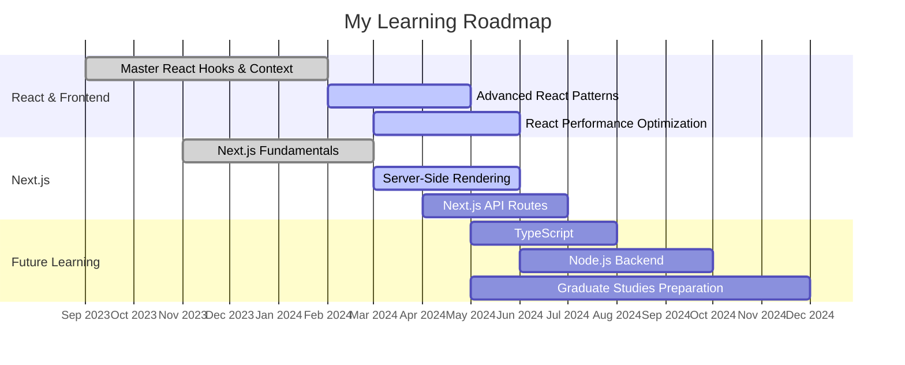

<!-- Custom Banner -->

  

<!-- Custom Banner Image -->

  

<!-- Summary & Profile Views -->

  
  
  

<!-- Animated Status Badges -->

  
  
  

<!-- Tech Stack Showcase - Animated -->

  <h3>💻 Technology Arsenal 💻</h3>
  
   
  
  
  
  

<!-- Animated Separator -->

  

## 👨‍💻 About Me

I'm **b1cey**, a passionate final-year undergraduate student pursuing **Computer Science** with a creative edge and technical mindset. My journey in technology is driven by an insatiable curiosity and a mission to build solutions that make a difference.

🔷 **Academic Excellence** | 🔷 **Innovative Problem Solver** | 🔷 **Creative Developer**

Throughout my academic journey, I've cultivated expertise in:

- 💻 **Software Development** - Building robust and scalable applications
- 🎨 **Web Design & Frontend Development** - Creating intuitive and visually appealing interfaces
- 🧪 **Problem Solving & Algorithmic Thinking** - Approaching challenges with analytical precision
- 🔄 **Agile Methodologies** - Embracing collaborative and iterative development processes
- 🛠️ **Modern JavaScript Frameworks** - Leveraging React and exploring Next.js

After graduation, I'm setting my sights on an **MSc in Software Engineering** to further deepen my expertise in **software architecture**, **machine learning**, and **artificial intelligence** - preparing to be at the forefront of tomorrow's technological innovations.

<!-- Enhanced GitHub Stats with Animation -->

  <h3>📊 GitHub Analytics & Contributions 📊</h3>
  
  <!-- 3D Contribution Calendar -->
  
  
  <!-- GitHub Streak Stats with Custom Theme -->
  
  
  <!-- GitHub Stats with Custom Theme -->
  
  
  <!-- Most Used Languages - Donut Chart -->
  
  
  <!-- Activity Graph -->
  

<!-- Trophies Section -->

  <h3>🏆 GitHub Trophies 🏆</h3>
  

<!-- Current Focus Section - Enhanced with Timeline -->
## 🔍 Current Focus & Learning Journey

  

### 📌 Current Priorities:

- 🌱 Mastering advanced concepts in **React** ecosystem
- 🚀 Building fully responsive and accessible web applications with **Next.js**
- 📊 Developing a portfolio of projects demonstrating fullstack capabilities
- 📚 Preparing applications for graduate studies in Software Engineering
- 🤝 Actively seeking collaboration opportunities on innovative projects

<!-- Enhanced Tech Stack Section with Progress Bars -->
## ⚡ Tech Stack & Expertise

<table align="center">
  <tr>
    <td valign="top" width="33%">
      <h3 align="center">Frontend Development</h3>
      

        
          
        
        
        
        
      

    </td>
    <td valign="top" width="33%">
      <h3 align="center">Currently Learning</h3>
      

        
          
        
        
        
      

    </td>
    <td valign="top" width="33%">
      <h3 align="center">Tools & Platforms</h3>
      

        
          
        
        
        
        
      

    </td>
  </tr>
</table>

<!-- Weekly Coding Stats -->

  <h3>⏱️ Weekly Development Breakdown ⏱️</h3>
  

<!-- Future Goals Section - Enhanced -->
## 🚀 Vision & Future Goals

  <table>
    <tr>
      <td align="center" width="25%">
        
         
        <h4>Advanced Education</h4>
        
Pursuing MSc in Software Engineering to master advanced software architecture and systems design

      </td>
      <td align="center" width="25%">
        
         
        <h4>Open Source</h4>
        
Contributing to meaningful open-source projects that align with my expertise and values

      </td>
      <td align="center" width="25%">
        
         
        <h4>Real-World Solutions</h4>
        
Developing impactful applications that address genuine needs and solve human problems

      </td>
      <td align="center" width="25%">
        
         
        <h4>AI Exploration</h4>
        
Expanding knowledge in AI and ML to integrate intelligent solutions into future projects

      </td>
    </tr>
  </table>

<!-- Animated Divider -->

  

<!-- Featured Projects Section -->
## 🗂️ Featured Projects

  
  

<!-- Random Dev Quotes -->

  <h3>💭 Developer Philosophy 💭</h3>
  

<!-- Footer with Animated Wave -->

<!-- Enhanced Connect Section -->

  <h3>🔗 Connect & Collaborate 🔗</h3>
  
  
  
  
  <!-- Add LinkedIn, Discord, etc. as needed -->
  
    
  

    <i>Thanks for visiting my profile! I'm always open to interesting collaborations and opportunities.</i>
     
    <i>Feel free to star ⭐ repositories you find interesting!</i>
  

  
  <!-- Spotify Now Playing -->
  
  
    
  <!-- Enhanced Visitor Counter with Refresh Date -->
  
   
  <i>Profile last updated: April 13, 2025</i>

